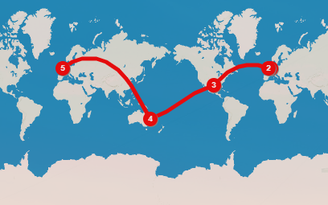

# About Me 
- I'm a PhD student working at the Max Planck Institute for Solar System Research in Göttingen, Germany
- Prior to my PhD studies, I graduated from Imperial College London with an MSci degree in Physics
- I was born in Belgium in Antwerp, but am lucky enough to have lived in London (UK), Houston (Texas) and Brisbane (Australia)
 
 

 
 

# Quick Facts
- Favourite Country: Australia
- Languages: I speak Flemish (Dutch), English, and am currently improving my German
- Hobbies: Cycling, Cricket, Hiking, Skiing, American Football (NFL)
- Favourite Movie: The Boat That Rocked, with Apollo 13 a close second